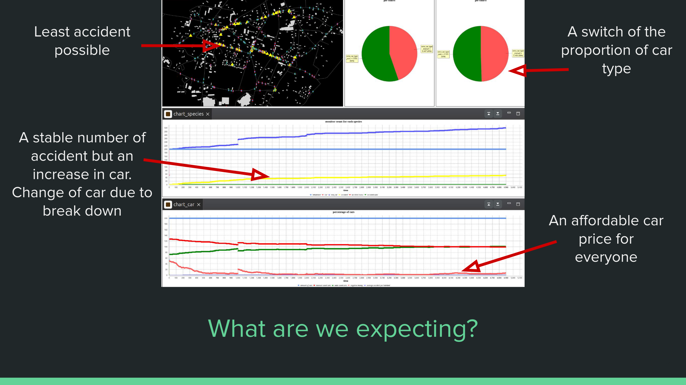
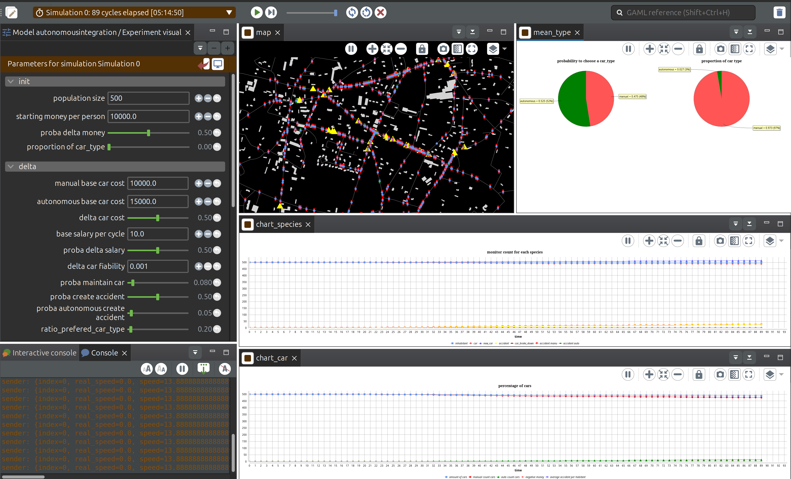
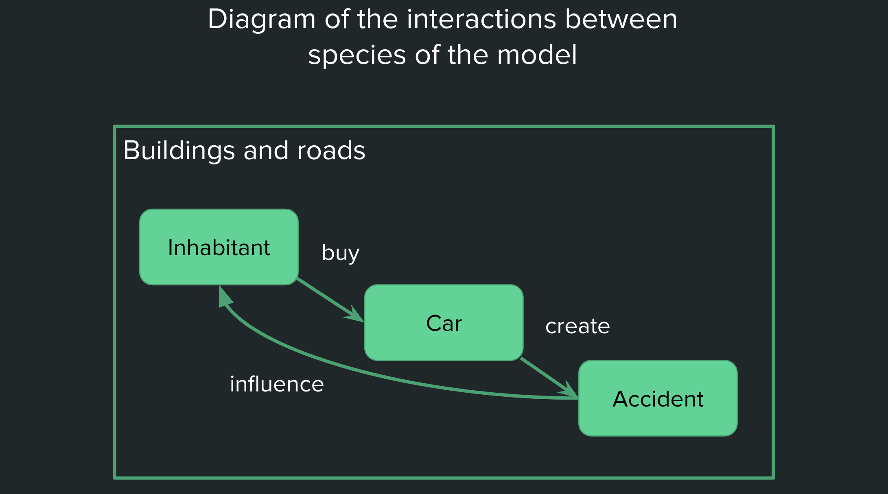

# Autonomous Cars Modeling Project

# Context

This repo is a modeling project for a master 2 class "Modeling and simulation of complex systems". It is done using Gama software and presents a report in this readme. 

## USTH December 2024

Nathan Choukroun \- USTH ICT M2 / ESILV A5 Embedded  
Supervised by Alexis Drogoul and Arthur Brugiere \- IRD

- [Autonomous Cars Modeling Project (WorkInProgress)](#autonomous-cars-modeling-project-workinprogress)
- [Context](#context)
  - [USTH December 2024](#usth-december-2024)
  - [Project topic presentation](#project-topic-presentation)
  - [Installation and setup](#installation-and-setup)
  - [Presentation](#presentation)
- [The model](#the-model)
  - [The cars](#the-cars)
- [Steps and features of conception](#steps-and-features-of-conception)
  - [Steps](#steps)
  - [Difficulties and choices](#difficulties-and-choices)
  - [Improvements](#improvements)
  - [Calibration](#calibration)
  - [Discussion of the results](#discussion-of-the-results)
- [Conclusion](#conclusion)
- [Sources](#sources)

## Presentation

Slides to present the problematic, the conception difficulties and the results. 

Link to the file of the slides
- [Presentation slides](assets/modeling_USTH_ICT_M2.pdf)





Video of the model running on specific parameters.

## Project topic presentation

What financial incentives should be provided to move a city to autonomous cars? 

With the rise of AI models and car technology development, 2020 marked the start of a new kind of driving for our roads. After experiencing and optimizing driving help functions, engineers developed better levels of self-driving autonomous cars. Even though it has not reached full control and reliable driving, we can already experience self-driving mechanisms and take a look at the ongoing transition of the market. 

The role of the model would be to optimize the integration of autonomous vehicles into a manual car system, by understanding the response of the agents in the system and the funding of new vehicles. It could show the impact of adding gradually or suddenly autonomous cars into a city, even how fast can autonomous cars integrate a long-lasting steady car market. 

To make the most realistic model: – it should start with an initial state based on a study location, probabilities of financial and decisional government actions and current price and availability of car configuration. – It should compute different speed, number of passengers, cost of purchase and maintenance, probabilities of crashes or breakdowns. – It will result in a model capable of testing and experimenting different contexts and aspects of the problem to help answer the integration and the democratization of autonomous vehicles. 

Output could be displayed either as a batch experiment to determine the precise financial assessments for the costs and the choices of funding or penalties. Or by an interactive map of a city district showing residents and vehicles controlled by input parameters. 

Extension 1: Make the experiment reflect different cities and compare them. It could try to compare highly different conditions like a reproduction of Paris, Hanoi, Beijing or even Los Angeles. 

Extension 2: Take into account law, criminality, salaries, experience and segregation. 

Extension 3: Adding different car companies with different car models that react differently to their inputs. 


## Installation and setup

You are free to fork, download and use the code to improve it or tweak it, import your city data or update cars data to better reflect the present situation. Many parameters are available for you to adapt it, or you can even add any parameter you seem useful. 

The model can be run by: 

- installing [Gama software](https://gama-platform.org/); 
- downloading ``` autonomous_integration.gaml```; 
- importing the model to a new project; 
- running the ```visual``` experiment; 
- modify the parameters depending on the context and rerun


# The model

Problematic: 
What financial incentives should be provided to move a city to autonomous cars? 

Reasons and objectives  
- understand the reason of buying a new kind of car
- imitate the stakeholders 
- understand the impact of the transition
- optimize the transition

Goals of the model
- decrease accidents on the roads
- find the best proportion of car type 
- try different financial plans 
- adapt it to any city context

The starting income will determine if they are able to buy a car or not. 
Other criteria (money cap, maintainance of personal car, experience with accidents) will conclude on choosing autonomous or manual cars. 
Implementation of a function that determine the probability of buying a car type
People are walking or taking cars to go to work. 

Residents life cycle: 
- I have to move around the city
- Having a car is easier
- I want to buy a car
- I can buy the car when I have enough money 
- The price of the car is around the market price, maybe not in my budget
- I want a specific car type
- I buy the car
- I get a salary to increase my money
- I can maintain my car based on my preference
- If my car is not maintained higher risk of accident
- if my car is autonomous, lower risk of accident
- If my car is in an accident
- I loose my car
- I had an accident with a manual car, 
- I may be able to buy a new car
- and repeat the process

Diagram of the interactions between species of the model


## The cars

Manage purchase price and maintenance price. Maintenance price is the pourcentage of the purchase price. 
Accidents happens when too many cars are too close to each others and low fiability caused by long distance driven. 

The type of the car is defined by the main proba_car_type (which could be a general parameter based on government influence, marketing and advertising influense) and the number of accident a resident has been part of. For each accident, the probability to move to autonomous is increased. 

# Steps and features of conception

## Steps

\- define constants  
\- define variables and parameters based on the context  
\- generate the city, import buildings and roads  
\- add habitant (to buildings and cars, maybe not visible but update color of parent location). Where is a person going? How does he go there?   
\- add cars (move based on people needs)  
\- add accident species 
\- add money problems (purchase, condition of the car) gain money for each trip  
\- implement accidents (caused by too many neighbours, low condition of the car)  
\- implement accident history: it is a list of accident for an inhabitant if his car was part of the accident
\- implement motivation to buy auto  
\- add timing to accidents to reflect the impact of autonomous to the safeness of a specific road or intersection. 

## Difficulties and choices

Developers must make choices and prioritize parameters that best represent the hypothesis, as not everything can be included in the model. For instance, population movement was implemented for both walking and driving, but these movements do not follow a common planning pattern. 
One of the main challenges was making decisions about the system. A significant amount of time was spent testing the program to find the right parameters and understand the most efficient way to build the model.

## Improvements

\- find realistic parameters for the model per city (probabilities, prices, salaries, maintenance recurrence)
\- memory optimisation for running better model performance
\- implement different speed of car based on urgency and respect of the law
\- matrix of probability for levels of autonomousness,
\- with different schelling population (the moderns, the olds, the mids to buy auto)  
\- population is starting with a relative wealth depending on their neighborhood and their building.   
\- start by walking and increase car desire 
\- cars can go out by themselves to train and analyse data, to turn and speed up by themselves. 

## Calibration

To ensure the accuracy of the model, real-world data is essential for calibration. The input parameters must be adjusted to reflect actual conditions. This involves setting the parameters at specific rates and comparing the model's output to real data. By doing so, we can validate the model's accuracy and make necessary adjustments to achieve a correct representation of the real-world scenario.

## Discussion of the results

The price of the car depending on the car type, actually does not significantly affect the overall model. This suggests that other factors, such as realistic randomness and personal preferences, play a more crucial role in the decision-making process of purchasing a car. 
Moreover, the effect of maintenance and accidents makes the whole model interesting, as it adds complexity and realism. By incorporating these elements, the model can better simulate real-world scenarios, providing more accurate insights into the dynamics of autonomous and manual car integration. 
We can also observe an effect of the accident localisation. The impact of the grid structure and complexity makes some roads more open to traffic and therefore to accidents. The model could be improved by adding a more realistic road network and a more realistic population movement. It would be helpful to start an anylisis of the traffic network and key points on reduicing accidents in the city.

# Conclusion

By incorporating various factors such as population demographics, wealth distribution, car desire, and accident impacts, the model offers valuable insights into the decision-making processes and behaviors of individuals in a mixed car environment.
The results indicate that while parameters does not significantly influence the overall model, other factors such as personal preferences, maintenance, and accidents play a crucial role. The inclusion of these elements adds complexity and realism to the model, making it a more accurate representation of real-world scenarios.
To further enhance the model, future work could focus on improving the road network and population movement to better reflect actual traffic conditions. 
This study demonstrates the potential of using simulation models to explore and understand the dynamics of autonomous vehicle integration. 
The findings can help explore new optimised options to ensure a smooth and successful transition to autonomous vehicles.

Throughout the development of this model, the use of the GAMA platform has proven to be both educational and practical. The Java-based modeling and simulation environment, facilitated the understanding and implementation of complex modeling scenarios by using intuitive keywords and less syntax. 
The platform's interface and documentation made it relatively easy to code and simulate various aspects of the model, from charts to interaction. 

# Sources

[Level of autonomous car - Wikipedia](https://en.wikipedia.org/wiki/Self-driving\_car\#Level\_5)

[Autonomous vehicles worldwide - statistics & facts](https://www.statista.com/topics/3573/autonomous-vehicle-technology/#topicOverview)

[The powerful role financial incentives can play in a transformation](https://www.mckinsey.com/capabilities/transformation/our-insights/the-powerful-role-financial-incentives-can-play-in-a-transformation)

[On the performance of shared autonomous bicycles: A simulation study](https://www.sciencedirect.com/science/article/pii/S2772424722000166)

[Urban Mobility Swarms](https://ieeexplore.ieee.org/abstract/document/10421869)

